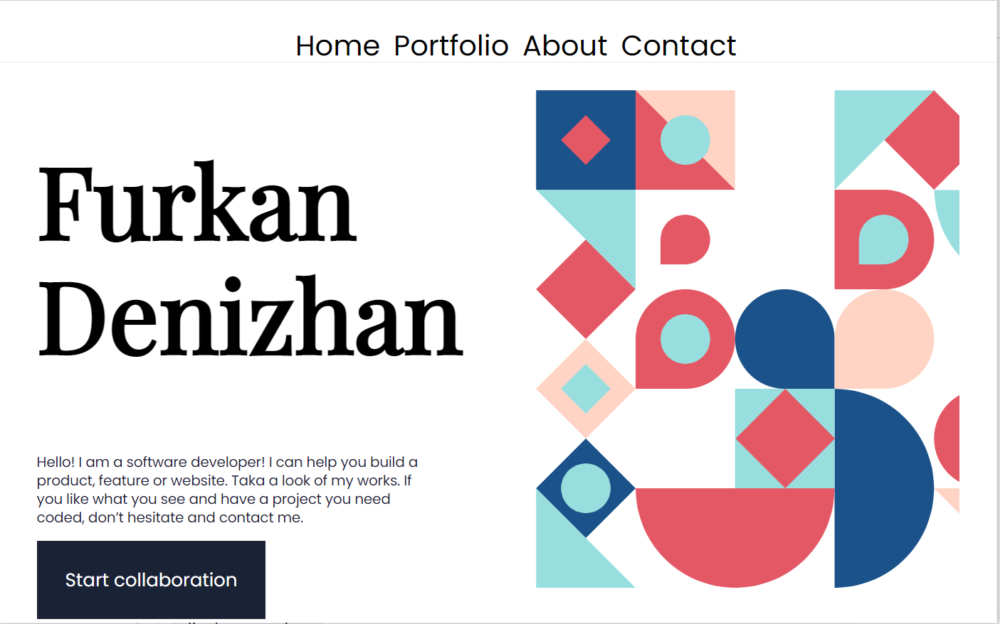

  

# My Portfolio

> Welcome to my portfolio project

## Built With

- Major languages : Html, CSS

## 👤 Author

- GitHub: [@nevisende](https://github.com/nevisende)
- Twitter: [@furkandnzhan](https://twitter.com/furkandnzhan)

## 🤝 Contributing

Contributions, issues, and feature requests are welcome!

Feel free to check the [issues page](../../issues/).

## Show your support

Give a ⭐️ if you like this project!

## Acknowledgments

- Inspired by the sample portfolio templates in the figma

## 📝 License

This project is [MIT](./MIT.md) licensed.
